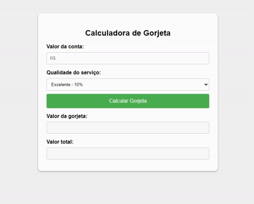

# Calculadora de Gorjeta

Projeto desenvolvido em HTML,CSS e Java Script. O site desenvolvido é uma calculadora de gorjeta, que de acordo com a nota fornecida pelo atendimento soma ao total da conta do cliente a porcentagem da gorjeta.

🔗 [Click here to access](https://n4ju15.github.io/calculadora_gorjeta/)

## Tecnologias

- HTML
- CSS
- JavaScript
- Git and Github

